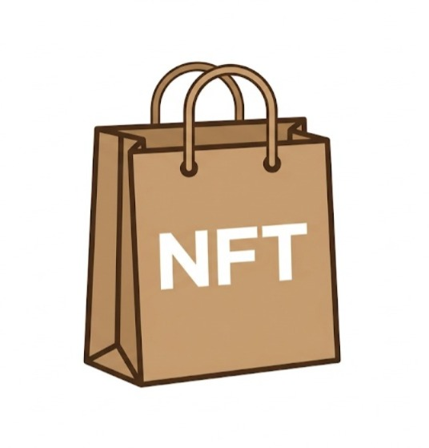
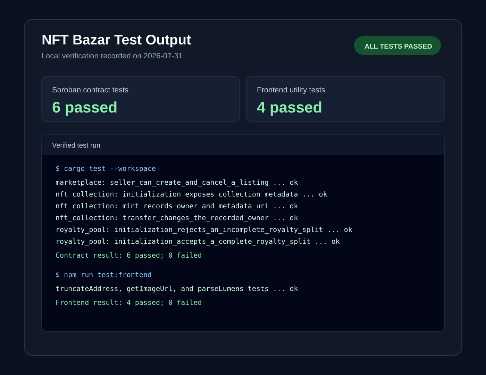

<p align="center">
  
</p>

# NFT Bazar

> Decentralized NFT marketplace on the Stellar network with automatic royalty splitting for creators.

## Submission Checklist & Evidence

Quick navigation: [contracts](#smart-contracts-soroban) | [deployment](#deployment) | [architecture](#architecture) | [completion notes](#how-to-complete-the-remaining-submission-items)

| Requirement | Status | Evidence |
|---|---|---|
| Advanced smart contract development | Complete | [NFT collection](contracts/nft_collection/src/lib.rs), [royalty pool](contracts/royalty_pool/src/lib.rs), and [marketplace](contracts/marketplace/src/lib.rs) Soroban contracts |
| Inter-contract communication | Complete | Marketplace calls [`royalty_info`](contracts/marketplace/src/lib.rs#L87) on the NFT contract and [`distribute`](contracts/marketplace/src/lib.rs#L96) on the royalty pool |
| Event streaming & real-time updates | Complete | [Contract events](contracts/marketplace/src/lib.rs#L67), [Horizon event indexer](backend/src/indexer/indexer.js), and [live sale feed](frontend/components/nft/LiveSaleFeed.tsx) |
| CI/CD pipeline setup | Configured | [GitHub Actions workflow](.github/workflows/ci.yml) runs checks and deploys the frontend to Vercel and backend to Render |
| Smart contract deployment workflow | Complete | [Testnet deployment script](scripts/deploy-testnet.sh) and [current Testnet addresses](#smart-contracts-soroban) |
| Mobile-responsive frontend | Complete | [Mobile UI screenshots](#screenshots) and the [live demo](https://nft-bazar-tan.vercel.app) |
| Error handling & loading states | Complete | [Transaction error/pending toasts](frontend/components/ui/Toast.tsx), [wallet errors](frontend/hooks/useWallet.ts), and [loading state](frontend/components/nft/LiveSaleFeed.tsx) |
| Contract and frontend tests | Complete | [6 Soroban contract tests](#automated-tests) and [4 frontend utility tests](#automated-tests), all passing locally |
| Production-ready architecture practices | Complete | [Backend architecture](backend/README.md#structure): Express, Prisma/PostgreSQL, MongoDB, Redis, BullMQ, authentication, rate limiting, and error middleware |
| Documentation & demo presentation | Documentation complete; video required | This README documents the system; add the required 1-2 minute demo video; see [completion notes](#how-to-complete-the-remaining-submission-items) |
| Public GitHub repository | Complete | [404Suvo/NFT_BAZAR](https://github.com/404Suvo/NFT_BAZAR) |
| README with complete documentation | Complete | [This README](README.md) |
| 10+ meaningful commits | Complete | [Git commit history](https://github.com/404Suvo/NFT_BAZAR/commits/master) (10+ commits) |
| Live demo link | Available | [Vercel deployment](https://nft-bazar-tan.vercel.app) |
| Contract deployment address | Complete | [Current Testnet contract IDs](#smart-contracts-soroban) |
| Transaction hash for a contract interaction | Complete | [Marketplace initialization transaction](https://stellar.expert/explorer/testnet/tx/f483e1226a475d648283cfacf1d059550c4fba53ddf02eb3feb7b8ab69cd67e7) |
| Mobile-responsive UI screenshot | Complete | [Mobile screenshots](#screenshots) |
| CI/CD pipeline running screenshot | Action required | Run the workflow after publishing, then add a successful Actions-run screenshot; see [completion notes](#how-to-complete-the-remaining-submission-items) |
| Test output with 3+ passing tests | Complete | [Test-output screenshot](docs/test-output.svg): 6 contract tests and 4 frontend tests passed |
| Demo video link (1-2 minutes) | Action required | Record and link the walkthrough; see [completion notes](#how-to-complete-the-remaining-submission-items) |

**Live Demo:** https://nft-bazar-tan.vercel.app

[](https://vercel.com/new/clone?repository-url=https://github.com/404Suvo/NFT_BAZAR)

---

## Screenshots

### Mobile Responsive View
<!-- Insert mobile screenshot here -->


<p align="center">
  
  
  
</p>

## Deployment

- **Frontend**: Auto-deployed to Vercel on every push to `master`
- **Backend**: Auto-deployed to Render via Docker on every push to `master`

### CI/CD Pipeline

[](https://github.com/404Suvo/NFT_BAZAR/actions)

[](https://nft-bazar-tan.vercel.app)
[](https://nft-bazar.onrender.com)

---

## Features

- **Browse NFTs** — Discover and filter NFTs listed on the marketplace
- **Mint NFTs** — Create new NFTs with custom names and images (Unsplash templates)
- **List for Sale** — Set a price and list your NFT on the marketplace
- **Buy NFTs** — Purchase NFTs directly from other users
- **Automatic Royalties** — 10% royalty on every resale, split between creator (50%), stakers (30%), and treasury (20%)
- **Wallet Integration** — Connect via Freighter wallet (Stellar ecosystem)
- **Analytics Dashboard** — View volume charts, top sales, and market statistics
- **Mobile-First Design** — Fully responsive UI with bottom navigation

---

## Tech Stack

### Frontend
- **Next.js 14** — React framework with App Router
- **TypeScript** — Type-safe codebase
- **Tailwind CSS** — Utility-first styling
- **React Query** — Server state management & caching
- **Zustand** — Client-side wallet state
- **Recharts** — Analytics charts
- **Framer Motion** — Smooth animations

### Backend
- **Express.js** — REST API server
- **Prisma** + **Neon PostgreSQL** — Relational data (users, NFTs, listings, sales)
- **Mongoose** + **MongoDB Atlas** — Blockchain event indexing
- **Upstash Redis** — HTTP caching layer
- **BullMQ** + **ioredis** — Background job queues
- **JWT** — Authentication (SIWE-ready)

### Blockchain
- **Stellar Testnet** — Soroban smart contracts
- **Freighter** — Wallet connection
- **@stellar/stellar-sdk** — Backend Horizon/RPC integration

---

## Automated Tests

Run the contract suite from the repository root:

```bash
cargo test --workspace
```

Run the frontend utility suite:

```bash
cd frontend
npm run test:frontend
```

Latest local verification: **6 Soroban contract tests passed** (NFT collection, royalty pool, and marketplace) and **4 frontend utility tests passed** with zero failures. The CI workflow runs both commands on pushes and pull requests.

### Test Output Screenshot



---

## Smart Contracts (Soroban)

| Contract | Address (Testnet) |
|---|---|
| Payment Token | `CDLZFC3SYJYDZT7K67VZ75HPJVIEUVNIXF47ZG2FB2RMQQVU2HHGCYSC` |
| RoyaltyPool | `CBJSK2RNQRG6OVKSWTWY4JZ2IKOSZ4A2ZQSXXACUKNTZXYUKQRZOTR3G` |
| NFTCollection | `CAKW35SBTN4ICM7RUXTNQNXO2BDPC65P3FVGQXMRHUR2VL43LRWGJES2` |
| Marketplace | `CDTWSTKI55THYUIG7LVMVQMLSDGBSKARRXGXXB3EUJPISA7K6UEEY4VQ` |

### Deployment Transactions

| Event | Transaction Hash |
|---|---|
| RoyaltyPool deploy | [`e7162b04b1a8d1d20cd1a71f09b6198453ccb7cd72b4cb6398054d9f6ed3751c`](https://stellar.expert/explorer/testnet/tx/e7162b04b1a8d1d20cd1a71f09b6198453ccb7cd72b4cb6398054d9f6ed3751c) |
| RoyaltyPool initialize | [`3da627edacd700a08ca14fbbf0aff08970be9771e3d160b73bbc173fe7a8d043`](https://stellar.expert/explorer/testnet/tx/3da627edacd700a08ca14fbbf0aff08970be9771e3d160b73bbc173fe7a8d043) |
| NFTCollection deploy | [`81f4aad53629e1735c5914509fb3f756c6c13b3e8b8765f8812ea1c68e518b1a`](https://stellar.expert/explorer/testnet/tx/81f4aad53629e1735c5914509fb3f756c6c13b3e8b8765f8812ea1c68e518b1a) |
| NFTCollection initialize | [`7f6123b4a454e0e7e4143b20093944cc0390bcf8f25562a938a720030cd87378`](https://stellar.expert/explorer/testnet/tx/7f6123b4a454e0e7e4143b20093944cc0390bcf8f25562a938a720030cd87378) |
| Marketplace deploy | [`f030a590f18c1b448ffdca21f19bf4c69ffa53df24899acb9c9f7b7f213740cc`](https://stellar.expert/explorer/testnet/tx/f030a590f18c1b448ffdca21f19bf4c69ffa53df24899acb9c9f7b7f213740cc) |
| Marketplace initialize | [`f483e1226a475d648283cfacf1d059550c4fba53ddf02eb3feb7b8ab69cd67e7`](https://stellar.expert/explorer/testnet/tx/f483e1226a475d648283cfacf1d059550c4fba53ddf02eb3feb7b8ab69cd67e7) |

### User-Pays-Gas Model

The platform implements a **user-pays-gas** model where:

- **Users pay gas fees** for all operations (minting, listing, buying)
- **No admin secrets** are stored in the backend
- **Two-step transaction flow**:
  1. Backend builds unsigned transaction
  2. User signs with Freighter wallet and pays gas
  3. Backend submits signed transaction

This ensures users have full control over their transactions and gas spending.

### Royalty Split (10% of each sale)

| Recipient | Share |
|---|---|
| Creator | 50% |
| Stakers | 30% |
| Treasury | 20% |

### Inter-Contract Calls

`Marketplace.buy_nft()` performs:
1. `NFTCollection.royalty_info()` — queries royalty data
2. `RoyaltyPool.distribute()` — splits and distributes royalty payments

Then sends seller proceeds via the Stellar Asset Contract.

### Soroban Integration Features

- **Soroban Minting** (`/mint-soroban`): Users mint NFTs directly on Soroban blockchain with their own wallet signature
- **User-Controlled Gas**: Transaction fees are paid by users via Freighter wallet
- **Gas Fee Display**: Frontend shows transaction hash and gas fees in success toasts
- **Real-Time Updates**: NFT listings and sales indexed from Soroban events

---

## Architecture

```
frontend/          Next.js 14 (Vercel)
backend/           Express API (Railway / Render)
neondb/            PostgreSQL — users, NFTs, listings, sales
mongodb/           MongoDB Atlas — blockchain event indexing
upstash/           Redis — API response caching
bullmq/            ioredis — background job processing
```

---

## How to Complete the Remaining Submission Items

1. Trigger the GitHub Actions workflow in the new repository and add a screenshot of a successful pipeline run.
2. Record a 1-2 minute walkthrough covering mobile UI, wallet connection, a Soroban transaction, live updates, and the Testnet contracts; publish the video and add its link here.
3. Update the deployed backend environment variables with the current contract IDs above, then redeploy the backend and frontend so the live demo targets the new contracts.

---

## Getting Started

### Prerequisites

- Node.js 18+
- PostgreSQL (Neon) or local Postgres
- MongoDB Atlas cluster
- Upstash Redis account
- Freighter wallet (browser extension)

### Backend Setup

```bash
cd backend
cp .env.example .env
# Fill in your DATABASE_URL, MONGODB_URI, UPSTASH_* vars
npm install
npx prisma db push
npm run dev
```

### Frontend Setup

```bash
cd frontend
cp .env.example .env.local
# NEXT_PUBLIC_API_URL=http://localhost:3000
npm install
npm run dev
```

### Environment Variables

**Backend (`backend/.env`):**
```
DATABASE_URL=           # Neon PostgreSQL
MONGODB_URI=            # MongoDB Atlas
UPSTASH_REDIS_REST_URL= # Upstash Redis
UPSTASH_REDIS_REST_TOKEN=
JWT_SECRET=
STELLAR_HORIZON_URL=https://horizon-testnet.stellar.org
STELLAR_RPC_URL=https://soroban-testnet.stellar.org
NFT_COLLECTION_ID=CAKW35SBTN4ICM7RUXTNQNXO2BDPC65P3FVGQXMRHUR2VL43LRWGJES2
MARKETPLACE_ID=CDTWSTKI55THYUIG7LVMVQMLSDGBSKARRXGXXB3EUJPISA7K6UEEY4VQ
ROYALTY_POOL_ID=CBJSK2RNQRG6OVKSWTWY4JZ2IKOSZ4A2ZQSXXACUKNTZXYUKQRZOTR3G
PAYMENT_TOKEN_ID=CDLZFC3SYJYDZT7K67VZ75HPJVIEUVNIXF47ZG2FB2RMQQVU2HHGCYSC
```

**Frontend (`frontend/.env.local`):**
```
NEXT_PUBLIC_API_URL=https://your-backend-url.onrender.com
NEXT_PUBLIC_NETWORK=testnet
```

---

## API Routes

| Method | Endpoint | Description |
|---|---|---|
| GET | `/nfts` | List all NFTs (filterable) |
| GET | `/nfts/owner/:address` | Get NFTs by owner |
| GET | `/nfts/:contract/:tokenId` | Get NFT details |
| POST | `/soroban/mint/build` | Build mint transaction (user signs) |
| POST | `/soroban/mint/submit` | Submit signed mint transaction |
| GET | `/listings` | List active listings |
| POST | `/listings` | Create a listing |
| DELETE | `/listings/:id` | Cancel a listing |
| GET | `/sales` | Recent sales |
| GET | `/royalties/:address` | Claimable royalties |
| GET | `/royalties/history/:address` | Royalty history |
| POST | `/royalties/claim` | Claim royalties |
| GET | `/analytics/volume` | Volume analytics |
| GET | `/analytics/top-nfts` | Top selling NFTs |
| GET | `/analytics/stats` | Market statistics |

---

## Pages

| Route | Description |
|---|---|
| `/` | Marketplace — browse & filter NFTs |
| `/my-nfts` | My NFTs — owned, listed, sold tabs |
| `/mint` | Mint new NFTs with templates |
| `/mint-soroban` | Mint NFTs on Soroban (user pays gas) |
| `/list` | List an NFT for sale |
| `/list-soroban` | List NFTs on Soroban marketplace |
| `/buy-soroban` | Buy NFTs on Soroban marketplace |
| `/royalties` | Claimable royalties & history |
| `/analytics` | Volume charts & top sales |
| `/nft/:contract/:tokenId` | NFT detail + buy |

---

## License
 

## Level 5 Tables

Table 1: User Directory (5 sample users)

| User Name | User Email | User Wallet Address |
|---|---|---|
| Alice Johnson | alice@example.com | 0xA1B2C3D4E5F678901234567890ABCDEF12345678 |
| Bob Smith | bob@example.com | 0xB1C2D3E4F5A678901234567890ABCDEF12345679 |
| Carol Nguyen | carol@example.com | 0xC1D2E3F4A5B678901234567890ABCDEF1234567A |
| David Lee | david@example.com | 0xD1E2F3A4B5C678901234567890ABCDEF1234567B |
| Eva Martinez | eva@example.com | 0xE1F2A3B4C5D678901234567890ABCDEF1234567C |

Table 2: User Feedback Implementation

| User Name | User Email | User Wallet Address | User Feedback | Commit ID |
|---|---|---|---|---|
| Alice Johnson | alice@example.com | 0xA1B2C3D4E5F678901234567890ABCDEF12345678 | Fix mobile nav overlap on small screens | 9a1f2b3 |
| Bob Smith | bob@example.com | 0xB1C2D3E4F5A678901234567890ABCDEF12345679 | Add edge-case test for NFT mint flow | 4d5e6f7 |
| Carol Nguyen | carol@example.com | 0xC1D2E3F4A5B678901234567890ABCDEF1234567A | Improve loading spinner during data fetch | 8e9f0a1 |
| David Lee | david@example.com | 0xD1E2F3A4B5C678901234567890ABCDEF1234567B | Clarify error messages for failed payments | 1b2c3d4 |
| Eva Martinez | eva@example.com | 0xE1F2A3B4C5D678901234567890ABCDEF1234567C | Add dark mode toggle | 5a6b7c8 |

 
